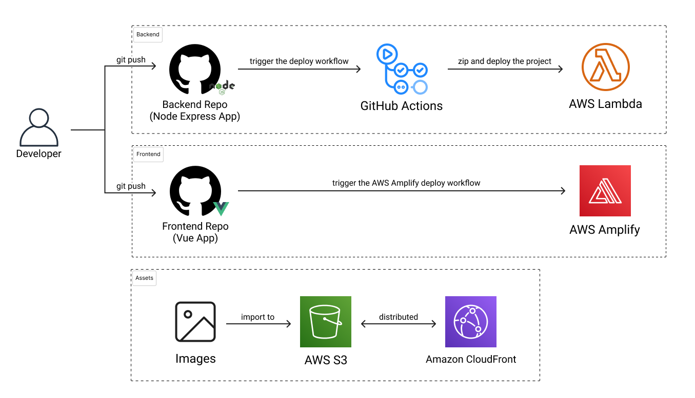
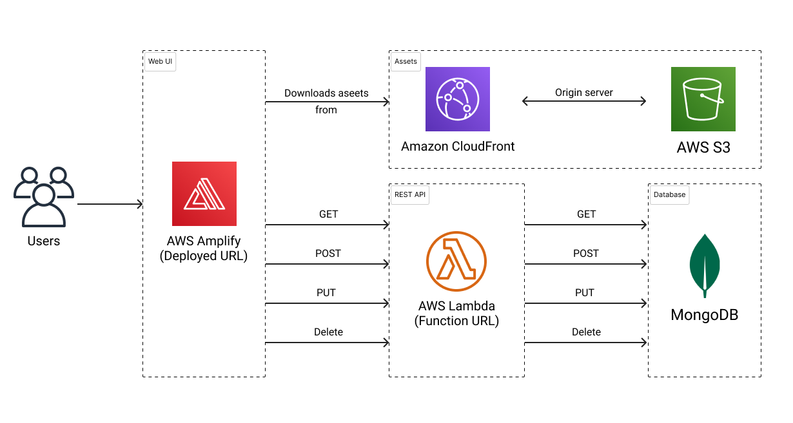

# [DineTech 餐飲 iPad POS 系統 - 後端 Repo](https://github.com/samchiu064/DineTech-FE)

此專案為提供給 [DineTech 餐飲 iPad POS 系統](https://github.com/samchiu064/DineTech-FE) 使用的 Node Express API。詳細使用技術如下：

- 專案架構：MVC
- 開發技術：Node.js, Express, TypeScript
- 資料庫：MongoDB, Mongoose ODM
- 部屬環境：AWS Lambda

關鍵字：Node.js, Express, MongoDB, Mongoose, MVC, AWS Lambda, Serverless, CICD

## 目錄

- [路由設計](#路由設計)
- [專案架構](#專案架構)
- [系統設計](#系統設計)
  - [Deployment Dependency](#deployment-dependency)
  - [Runtime Dependency](#runtime-dependency)
- [使用技術與工具](#使用技術與工具)
  - [設計相關](#設計相關)
  - [前端開發相關](#前端開發相關)
- [關於作者](#關於作者)
- [License](#License)

---

## 路由設計

|API 名稱|路由群組|方法|路由|
|-|-|-|-|
|取得顧客|顧客|GET|/guests/|
|新增顧客|顧客|POST|/guests|
|修改顧客|顧客|PUT|/guests/:id|
|刪除單筆顧客|顧客|DELETE|/guests/:id|
|刪除所有顧客|顧客|DELETE|/guests|
|取得菜單|菜單|GET|/menus/|
|取得單筆菜單|菜單|GET|/menus/:id|
|新增菜單|菜單|POST|/menus|
|修改菜單|菜單|PUT|/menus/:id|
|刪除單筆菜單|菜單|DELETE|/menus/:id|
|刪除所有菜單|菜單|DELETE|/menus|
|取得配料|配料|GET|/toppings/|
|新增配料|配料|POST|/toppings|
|修改配料|配料|PUT|/toppings/:id|
|刪除單筆配料|配料|DELETE|/toppings/:id|
|刪除所有配料|配料|DELETE|/toppings|
|取得訂單|訂單|GET|/orders/|
|取得單筆訂單|訂單|GET|/orders/:id|
|新增訂單|訂單|POST|/orders|
|修改訂單|訂單|PUT|/orders/:id|
|刪除單筆訂單|訂單|DELETE|/orders/:id|
|刪除所有訂單|訂單|DELETE|/orders|
|取得回饋|回饋|GET|/feedbacks/|
|新增回饋|回饋|POST|/feedbacks|
|修改回饋|回饋|PUT|/feedbacks/:id|
|刪除單筆回饋|回饋|DELETE|/feedbacks/:id|
|刪除所有回饋|回饋|DELETE|/feedbacks|

---

## 專案架構

<pre>
|- .github           # GitHub 專用路徑，如工作流程和操作
|- assets            # 靜態資源
|- bin               # 運行 Express server 的進入點
|- connections       # 資料庫連接配置和設置
|- controllers       # 控制器處理應用程式路由的業務邏輯
|- interfaces        # TypeScript 介面
|- models            # MongoDB 的 Mongoose 模型
|- node_modules      # 專案 Node.js 模組
|- routes            # 定義 API 端點的 Express 路由
|- services          # 處理業務邏輯的服務層，與控制器分離
|- utils             # 應用程式中使用的工具函數和輔助函數
|- eslintrc.json     # 用於程式碼質量和規範的 ESLint 配置
|- .gitignore        # 指定有意忽略的未追蹤文件
|- .prettierrc       # 用於程式碼格式化的 Prettier 配置
|- app.ts            # 定義 Express 應用程式的主文件
|- example.env       # 環境變量示範文件
|- package.json      # NPM 包配置
|- package-lock.json # NPM 依賴的自動生成文件
|- README.md         # 項目文檔
|- tsconfig.json     # TypeScript 編譯器配置文件
</pre>

## 系統設計

### Deployment Dependency

### Runtime Dependency

### 使用技術與工具

- [Node.js](https://nodejs.org/en)
- [TypeScript](https://www.typescriptlang.org/)
- [Express](https://expressjs.com/)
- [Mongoose](https://mongoosejs.com/)
- [serverless-http](https://github.com/dougmoscrop/serverless-http)
- [cors](https://github.com/expressjs/cors)
- [dotenv](https://github.com/motdotla/dotenv)
- [moment-timezone](https://momentjs.com/timezone/)
- [cross-env](https://github.com/kentcdodds/cross-env)
- [nodemon](https://nodemon.io/)
- [ts-node](https://github.com/TypeStrong/ts-node)
- [Prettier](https://prettier.io/)
- [Eslint](https://eslint.org/)

---

## 關於作者

Sam Chiu [(LinkedIn)](https://www.linkedin.com/in/sam-chiu-4b7557137/)

本作品僅供個人學習及交流使用。若您對本作品有任何疑問或想法，歡迎來信讓我知道。

  

---

## License

Copyright © 2024 Sam Chiu. All rights reserved.
